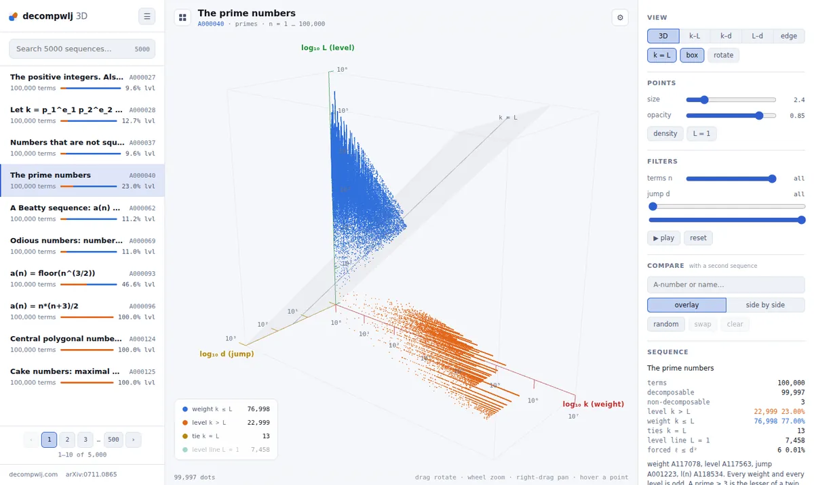
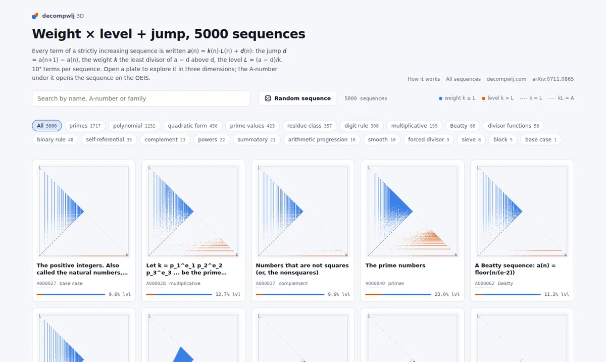
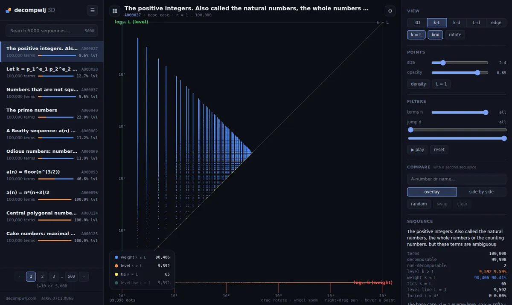
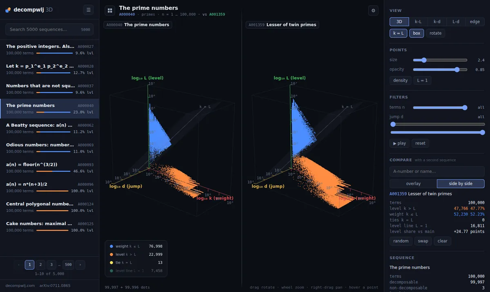
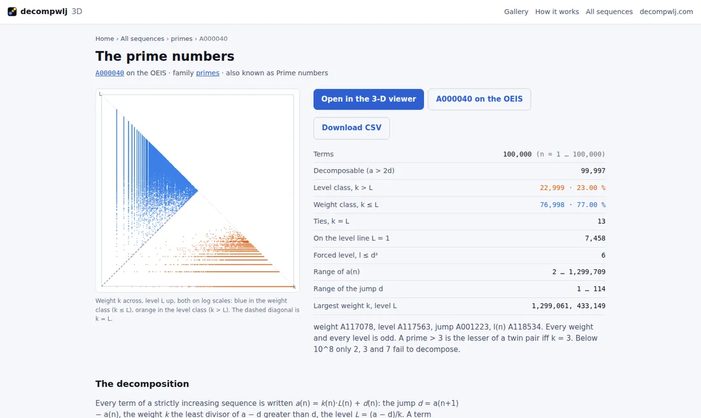
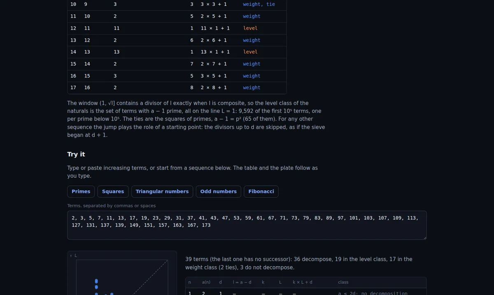

# decompwlj 3D

**An interactive atlas of integer sequences, seen through one simple decomposition.**
5000 sequences from the [OEIS](https://oeis.org), 10⁵ terms each, as a gallery of plates and an
explorable 3-D point cloud.

**▶ Live site: [decompwlj.net](https://decompwlj.net/)** · [How it works](https://decompwlj.net/learn/) ·
[All sequences](https://decompwlj.net/seq/) · [](https://github.com/decompwlj/decompwlj3dopus/actions/workflows/checks.yml)



## The idea in one line

Every term of a strictly increasing sequence is written as a product plus a jump:

> **a(n) = k · L + d**   jump **d** = a(n+1) − a(n) · weight **k** = the least divisor of a − d above d · level **L** = (a − d)/k

For example, the prime 113 is followed by 127, so d = 14 and a − d = 99. The least divisor of 99
above 14 is 33, so **113 = 33 × 3 + 14**. A term is in the **level class** when k > L (orange) and in
the **weight class** when k ≤ L (blue). It is a Euclidean division of a by k whose remainder is the
jump; for the natural numbers the weight is the smallest prime factor of a − 1, the sieve of
Eratosthenes. The [How it works](https://decompwlj.net/learn/) page explains it step by step with a
live example. Background: [decompwlj.com](https://decompwlj.com) and
[arXiv:0711.0865](https://arxiv.org/abs/0711.0865).

## A quick tour

| | |
|---|---|
|  |  |
| **Gallery** — 5000 plates, search by name, A-number or family, random sequence. | **k–L view** — a card opens the flat plate; drag it and it tilts smoothly into 3-D. Here the natural numbers: the sieve of Eratosthenes. |
|  |  |
| **Compare** two sequences, overlaid or side by side, with one camera. | **A page per sequence** — counts, notes, OEIS link and a CSV of all 10⁵ terms. |



## Features

- 🖼️ **Gallery** of 5000 weight–level plates with search, a family selector, a random button,
  **sorting** (A-number, name, level share, ties, forced level, largest terms) and **filters**
  (with ties, every term decomposes, level ≥ 50 %, forced level ≥ 90 %), remembered in the browser;
  cards and images load as you scroll.
- 🧊 **3-D viewer** (three.js / WebGL) of log k, log L, log d: preset views (3D, k–L, k–d, L–d,
  edge), point size and opacity, density mode, the L = 1 line, filters on n and d, a sweep along n.
  Changing view is one smooth camera flight (the perspective flattens into the 2-D views and back,
  a "dolly zoom"), and a new sequence fades in. The views fit the free space of any screen, from a
  phone (portrait or sideways) to QHD and UHD, with points and labels scaled to the canvas.
- ⚖️ **Compare** two sequences, overlaid or side by side.
- 🔗 **Shareable links** — the URL records the sequence, view, mode and comparison.
- 📄 **Static page per sequence** for search engines, with a **CSV download** (`n;a;weight;level;jump`,
  rebuilt in the browser) and its own link-preview image.
- 🎓 **How it works** page with theory and a live example.
- 📱 **On phones** the controls open as a bottom sheet with the plot kept in view above it (Done,
  or swipe the handle down, to close), the family chips scroll sideways, and buttons are sized for
  fingers.
- 🌗 Light and dark themes, keyboard shortcuts, PNG snapshots.
- 📦 Plain static files: no server code, no database, no build step.
- 🔒 Privacy-friendly visit counts ([GoatCounter](https://www.goatcounter.com)): no cookies, no personal data.

## Run it locally

```sh
git clone https://github.com/decompwlj/decompwlj3dopus.git
cd decompwlj3dopus
python3 -m http.server 8000        # then open http://localhost:8000/
```

Any static server works (`npx serve`, `php -S localhost:8000`, …). Opening `index.html` straight
from disk does not: browsers block `fetch()` on `file://`, and the page says so.

Visitors need a current browser with WebGL, import maps and `DecompressionStream`
(Chrome/Edge 111+, Firefox 113+, Safari 16.4+). The gallery works without WebGL.

## Deploy

The site is the repository root. All paths are relative, so it works at a domain root or in a
subfolder.

### On GitHub Pages

1. Push the repository to GitHub (or fork it).
2. **Settings → Pages → Build and deployment**: Source **Deploy from a branch**, branch **main**,
   folder **/ (root)**, **Save**.
3. A minute or two later the site is at `https://<user>.github.io/<repository>/`
   (the **Actions** tab shows each publication). Every push to `main` republishes it.

The empty `.nojekyll` file makes Pages serve the files as they are. The site is about **945 MB**
against Pages' **1 GB** limit (soft bandwidth limit: 100 GB a month), which leaves room for about
250 more sequences; beyond that the data would have to live on another host.

### With a custom domain and HTTPS

This repository serves **decompwlj.net** through its `CNAME` file. For your own domain, put its
name in `CNAME` (or set it in **Settings → Pages → Custom domain**), then add the DNS records
below at your registrar. When the DNS check passes, GitHub issues a Let's Encrypt certificate
(minutes, sometimes up to 24 h); then tick **Enforce HTTPS**.

<details>
<summary><b>DNS records for GitHub Pages</b></summary>

| Type | Name | Value |
|---|---|---|
| A | @ | `185.199.108.153`, `185.199.109.153`, `185.199.110.153`, `185.199.111.153` (four records) |
| AAAA | @ | `2606:50c0:8000::153`, `2606:50c0:8001::153`, `2606:50c0:8002::153`, `2606:50c0:8003::153` (four records) |
| CNAME | www | `<user>.github.io.` |

- Remove any other A/AAAA record on the apex, and any registrar "web redirection" or parking
  page: they block HTTPS.
- If the zone has a CAA record, it must allow `letsencrypt.org`.
- Recommended: verify the domain under your account's **Settings → Pages** (a TXT record), so no
  one else can use it on GitHub Pages.

</details>

### On any other static host

Upload the repository root (at least `index.html`, `data/`, `thumbs/`, `vendor/`, plus `seq/`,
`family/`, `learn/`, `share/` for the static pages) to Apache, nginx, Caddy, Netlify, Cloudflare
Pages, S3 + CDN… The server must:

- serve `data/seq/**/chunk-NNN.bin.gz` either as a raw gzip file or with `Content-Encoding: gzip`
  (the page handles both);
- return **404** for missing files, not `index.html`;
- not put authentication in front of the data.

Ready-made configurations are in [`deploy/`](deploy/) (`apache-vhost.conf`, `nginx.conf`).
Long cache lifetimes for `data/`, `thumbs/`, `share/` and `vendor/` are safe.

### Search engines and link previews

`tools/seo.py` writes the static pages that search engines can index (the app itself lives in a
URL fragment): one page per sequence, the full list, one page per family, the How it works page,
`404.html` (which redirects `/A000040` to `/seq/A000040/`), `sitemap.xml`, `robots.txt`, `og.png`
and a 600 × 315 share image per sequence. The base URL comes from `CNAME`; without one, pass
`python3 tools/seo.py --base https://<user>.github.io/<repo>`.

To get indexed: add the domain to **Google Search Console** (verify with a DNS TXT record) and
submit `https://<domain>/sitemap.xml`; do the same in **Bing Webmaster Tools** (it also feeds
DuckDuckGo and Yahoo). On GitHub, fill the repository's **About** box (description, website,
topics) and upload `og.png` under **Settings → General → Social preview**.

### Visit counts (GoatCounter)

Every page loads [GoatCounter](https://www.goatcounter.com), a free, open-source counter for
non-commercial sites: **no cookies, no personal data, nothing stored in the browser**, so no
consent banner is needed. The gallery counts as `/`, each sequence opened in the viewer as
`/#A000040` (whatever its view), the static pages under their own path, and each CSV download as
the event `csv/A000040`. Visits from `localhost` are ignored, and the site works the same if a
blocker stops the counter.

To turn it on for decompwlj.net:

1. Sign up at [goatcounter.com/signup](https://www.goatcounter.com/signup) with the code
   **`decompwlj`**: the dashboard is then <https://decompwlj.goatcounter.com>.
2. In its **Settings**, set the site domain to `decompwlj.net`; optionally make the dashboard
   public, or ignore your own visits from the dashboard's settings.

Counts appear as soon as the pages are live. To use another code, change the URL in the
`data-goatcounter` script of `index.html` and `GOATCOUNTER_URL` in `tools/seo.py`, then run
`python3 tools/seo.py`; to remove the counter, delete that script and set `GOATCOUNTER_URL = ''`.

### Updating

Merge into `main` (GitHub Pages) or replace the files. If a visitor still sees the old version,
a hard reload (Ctrl+F5, Cmd+Shift+R) clears the cached `index.html` and `data/catalog.csv`.

## Using the site

| Link | Opens |
|---|---|
| `/` or `/#home` | the gallery |
| `/#A000040` or `/#primes` | a sequence in the viewer |
| `/#primes.kLd.iso.solid.one` | …with a view (`iso`, `xy`, `xz`, `yz`, `edge`), a point mode (`solid`, `density`) and the L = 1 highlight |
| `/#primes.kLd.iso.solid.vs-A001359` | a comparison (add `.split` for side by side) |
| `/seq/A000040/` (or `/A000040`) | the sequence's static page, with **Download CSV** |
| `/seq/`, `/family/primes/`, `/learn/` | all sequences, one family, how it works |

**Keys** — gallery: `/` search, `R` random, `T` theme, `Home` top. Viewer: `G`/`Esc` gallery,
`↑`/`↓` neighbouring sequence, `R` random, `1`–`5` views, `V` overlay/side by side, `C`/`P` side
panels, `T` theme, `Space` sweep along n.

Opened from a gallery card or from its sequence page (click the plate), a sequence starts in the
flat k–L view, the same picture as the plate; the first grab-and-drag tilts it into 3-D. A link
that names a view keeps it. In the viewer, **sequence page** (next to the A-number, and in the
Sequence panel) leads back to the sequence's page; browsers that support it cross-fade between the two.

## Under the hood

<details>
<summary><b>Repository layout</b></summary>

| Path | Contents |
|---|---|
| `index.html` | The whole app: gallery, viewer, CSS and JavaScript (~110 kB) |
| `data/catalog.csv` | One row per sequence: id, A-number, OEIS name, family, index range, counts, ranges, note |
| `data/seq/<id>/chunk-NNN.bin.gz` | The data: 50,000 terms per chunk, compact binary, gzip |
| `thumbs/<id>.webp` | Gallery plates (480 × 480, transparent, lossless WebP) |
| `share/<id>.jpg` | Link previews of the sequence pages (600 × 315) |
| `seq/`, `family/`, `learn/`, `404.html`, `sitemap.xml`, `robots.txt`, `og.png` | Static pages, written by `tools/seo.py` |
| `css/pages.css` | Stylesheet of the static pages |
| `vendor/` | three.js r169 and OrbitControls, unmodified (MIT) |
| `tools/` | Generator, OEIS metadata, encoders, audit and page builders (not needed at runtime) |
| `tests/smoke.mjs`, `.github/workflows/checks.yml` | Automatic checks |
| `deploy/` | Apache and nginx examples |
| `docs/SEQUENCES.md` | Every sequence by family, and how the data was verified |
| `docs/img/` | The screenshots of this README |
| `favicon.svg`, `favicon.ico`, `apple-touch-icon.png` | The site icon (light theme), at the root where browsers look for it |
| `CNAME`, `.nojekyll` | GitHub Pages: custom domain; serve files as they are |

</details>

<details>
<summary><b>Data format</b></summary>

`data/catalog.csv` (RFC 4180, header row): `id` (folder and URL name), `anumber`, `name`, `alias`,
`family`, `n0` (first index = OEIS offset), `terms`, `chunks`, `chunk_rows`, the counts
`decomposable`, `level`, `weight`, `ties`, `level_one`, `forced`, the ranges `amin` … `dmax`,
and the `note`.

Each chunk is gzip-compressed binary; every number is an unsigned LEB128 varint:

| Part | Contents |
|---|---|
| `dwj2` | format tag (4 bytes) |
| `m` | 1 byte: jumps stored as `0` d, `1` first differences, `2` second differences (zigzag) |
| `n`, `a0` | rows in the chunk, first term |
| `j[0…n−1]` | the jumps, coded by `m` |
| `s[0…n−1]` | the smaller factor of a − d = k·L: `0` no decomposition, `2k` if k ≤ L, `2L + 1` if L < k |

Every term is present, so row i is index n0 + i. The page rebuilds a as a running sum of the
jumps and the other factor as (a − d) divided by the stored one, and rejects a chunk if anything
is inconsistent. All values are below 2⁵³. `tools/compact.py` has `encode()` and `decode()` for
Python; older `dwj1` chunks are still read. A sequence weighs from under 1 kB to 0.6 MB (median
0.16 MB); the gzip streams are made by Zopfli, about 4 % smaller than gzip -9.

</details>

## Rebuilding the data

The pipeline is deterministic: unchanged sequences produce no diff. It needs a C compiler, Python
3.9+ with `numpy`, `Pillow` and `zopfli`, ~2 GB of RAM, ~13 GB of disk and about two hours of CPU.

```sh
cd tools
cc -O2 -o decompwlj_gen decompwlj_gen.c -lm
./decompwlj_gen raw                 # every sequence: raw a,d,k,L chunks + catalog.csv (~60 min)
./decompwlj_gen raw primes 200000   # or one sequence, at any length below 2^53
python3 names.py raw                # OEIS names into the catalogue (from oeis.json)
python3 audit.py raw                # independent check of every row and of the OEIS terms
python3 compact.py raw ../data      # the compact chunks the site loads
python3 thumbs.py  raw ../thumbs    # the gallery plates
python3 seo.py                      # static pages, share images, sitemap, robots.txt
```

**To add a sequence:** write a generator in `tools/decompwlj_gen.c` (it fills `t[0..cnt-1]` with
strictly increasing terms), add its entry to the `defs[]` table, record its OEIS data with
`python3 fetch_oeis.py A123456`, then run the pipeline; `audit.py` must report "all clear".

### Automatic checks

Every pull request and push to `main` runs [`checks.yml`](.github/workflows/checks.yml): the
generator compiles with `-Werror`; `tools/check_site.py` finds every file in place and rebuilds
four sequences byte for byte; `audit.py` re-verifies one sequence in 25 from the site's own chunks;
`seo.py` must rewrite the same HTML; and `tests/smoke.mjs` drives Chromium through the gallery,
the viewer, sixty sequences, a CSV download and the How it works page. Locally:

```sh
python3 tools/check_site.py && python3 tools/audit.py data --every 25
python3 -m http.server 8765 & node tests/smoke.mjs      # needs: npm install playwright
```

## Troubleshooting

| Symptom | Fix |
|---|---|
| Blank page / "Open this page through a web server" | Serve it over HTTP (see [Run it locally](#run-it-locally)). |
| Old version after an update | Hard reload (Ctrl+F5, Cmd+Shift+R); Pages can take a few minutes. |
| "Enforce HTTPS" greyed out | DNS not pointing at GitHub yet, a leftover A record or redirection, or a CAA record blocking Let's Encrypt. Fix, then remove and re-add the custom domain. |
| A sequence fails to load (404 on a chunk) | The server rewrites missing files, or `data/` was not fully uploaded. |
| Gallery works, 3-D view does not | WebGL is off (some VMs and remote desktops): enable hardware acceleration. |

## Credits and licences

- The decomposition into weight × level + jump: Rémi Eismann —
  [arXiv:0711.0865](https://arxiv.org/abs/0711.0865), [decompwlj.com](https://decompwlj.com).
- Sequence names, offsets and reference terms: [the OEIS](https://oeis.org), CC BY-SA 4.0, read
  from [github.com/oeis/oeisdata](https://github.com/oeis/oeisdata).
- [three.js](https://threejs.org) r169, © 2010–2024 three.js authors, MIT (`vendor/LICENSE-three.js.txt`).
